# cathode-ray-tube

A native macOS terminal emulator that looks like a cathode-ray tube, written in
Common Lisp.

It is a port of [cool-retro-term](https://github.com/Swordfish90/cool-retro-term)
by Filippo Scognamiglio: the same phosphor burn-in, bloom, scanlines, barrel
distortion, chroma tint, jitter and horizontal-sync tearing, and the same
fourteen profiles — but with the GLSL translated to Metal, the Qt6/QML
application replaced by Cocoa driven from Lisp through the
[`objc`](https://github.com/lispnik/objc) bindings, and the terminal emulation
supplied by a vendored [libvterm](https://www.leonerd.org.uk/code/libvterm/).

**Status: it looks like a cathode-ray tube.** `make run` opens an 80×25 window,
runs your shell, and draws it through the full effect chain — phosphor burn-in,
bloom, scanlines, barrel distortion, chroma tint, jitter, horizontal-sync
tearing and a procedural bezel — under any of the fourteen ported profiles.

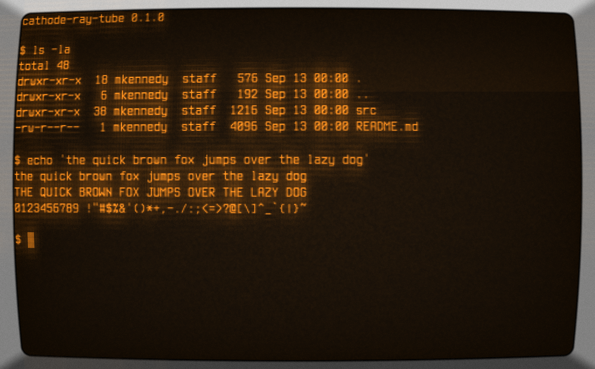

All fourteen, each in the face its profile names — `make gallery` regenerates
them:

| | | |
|---|---|---|
|  Default Amber | 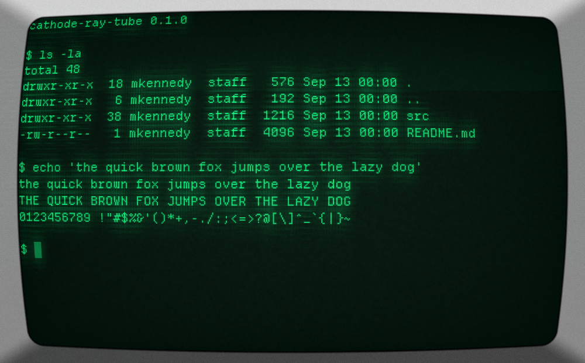 Monochrome Green | 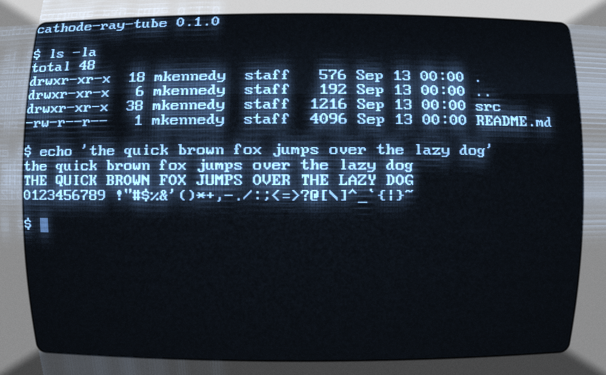 Deep Blue |
| 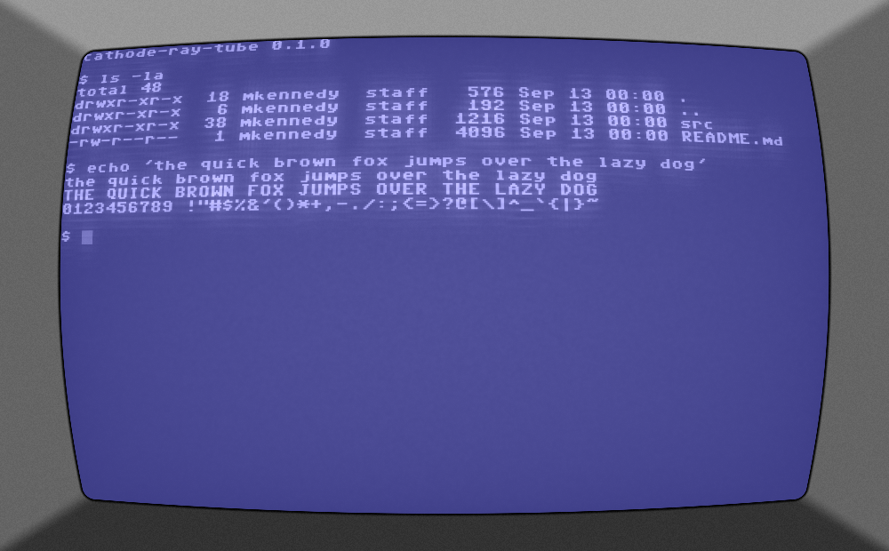 Commodore 64 | 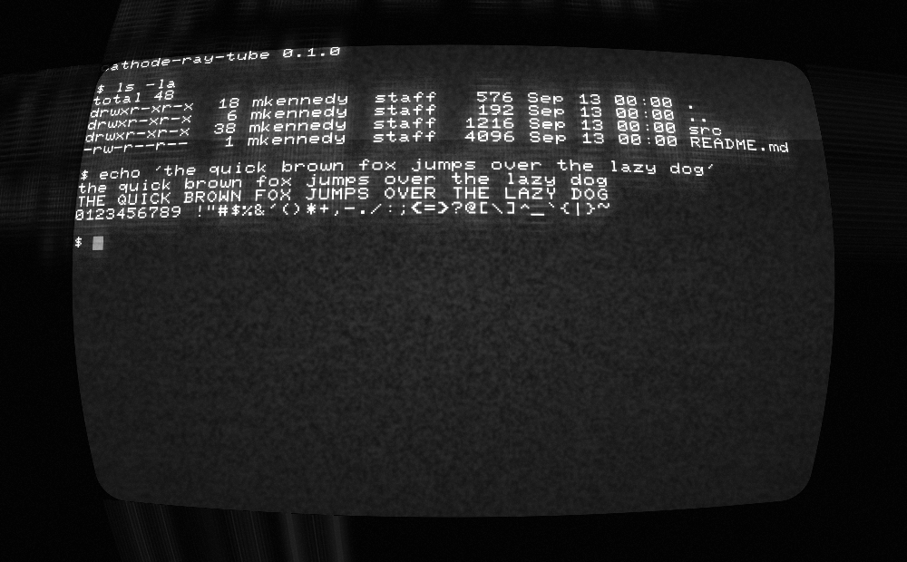 Commodore PET | ![Apple ][](docs/gallery/apple.png) Apple ][ |
| 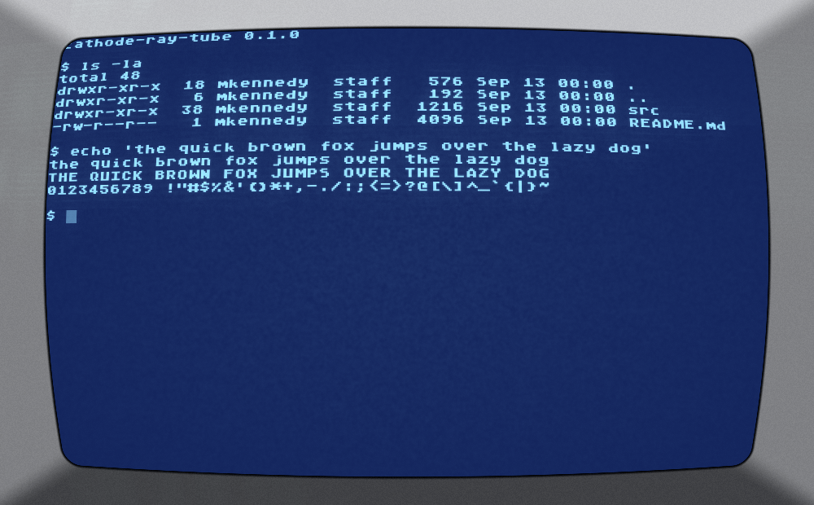 Atari 400 | 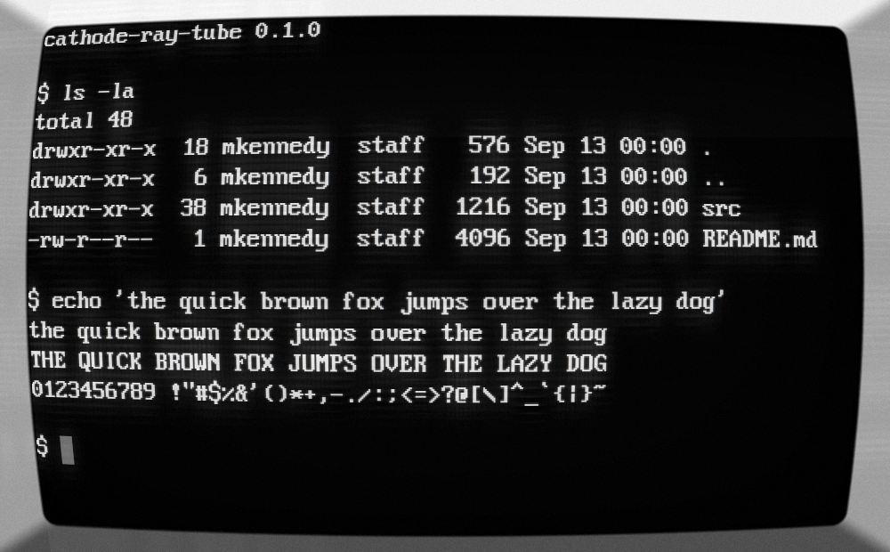 IBM VGA 8x16 | 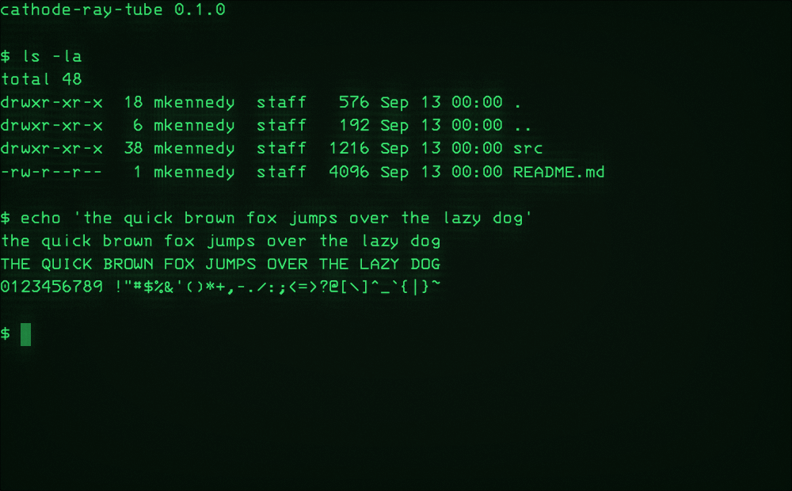 IBM 3278 Reborn |
| 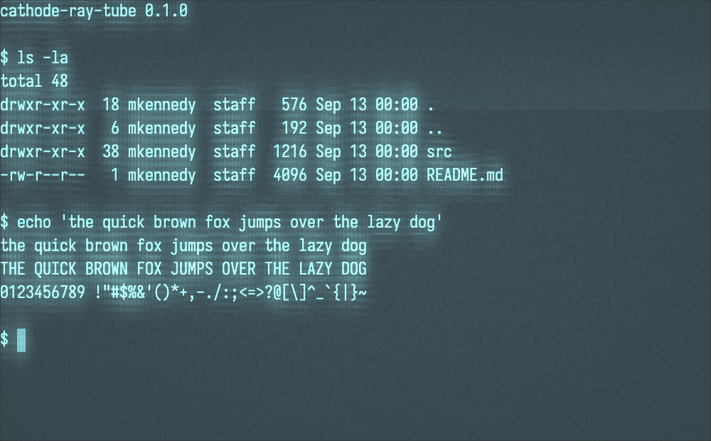 Neon Cyan | 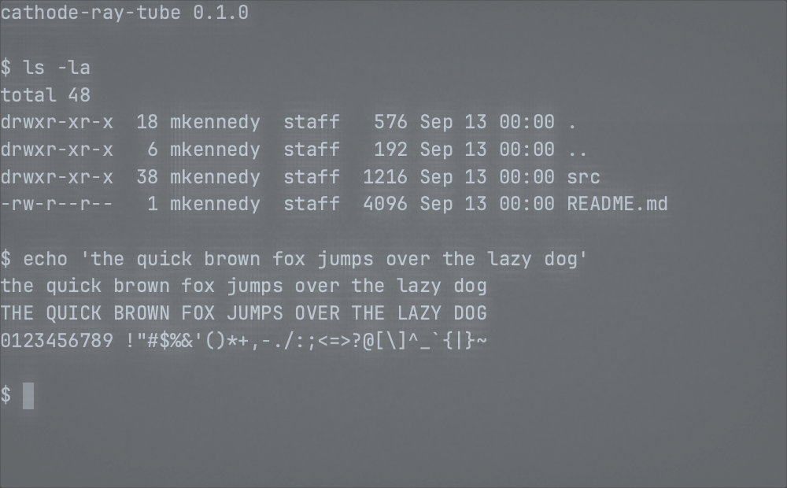 Ghost Terminal | 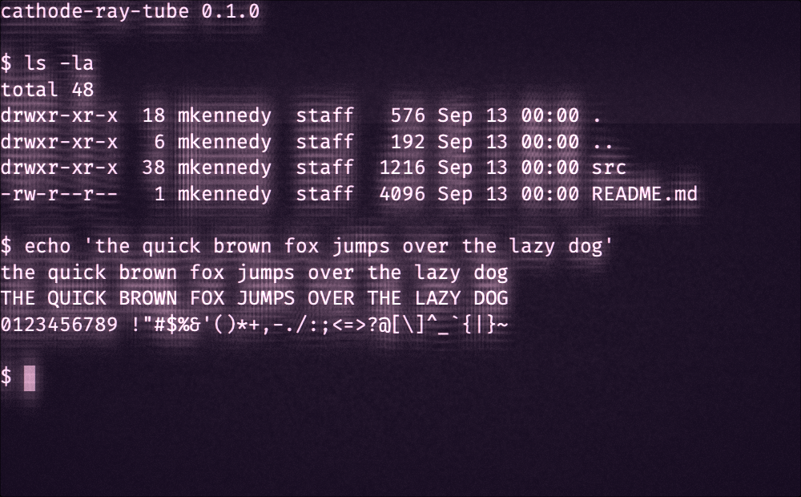 Plasma |
| 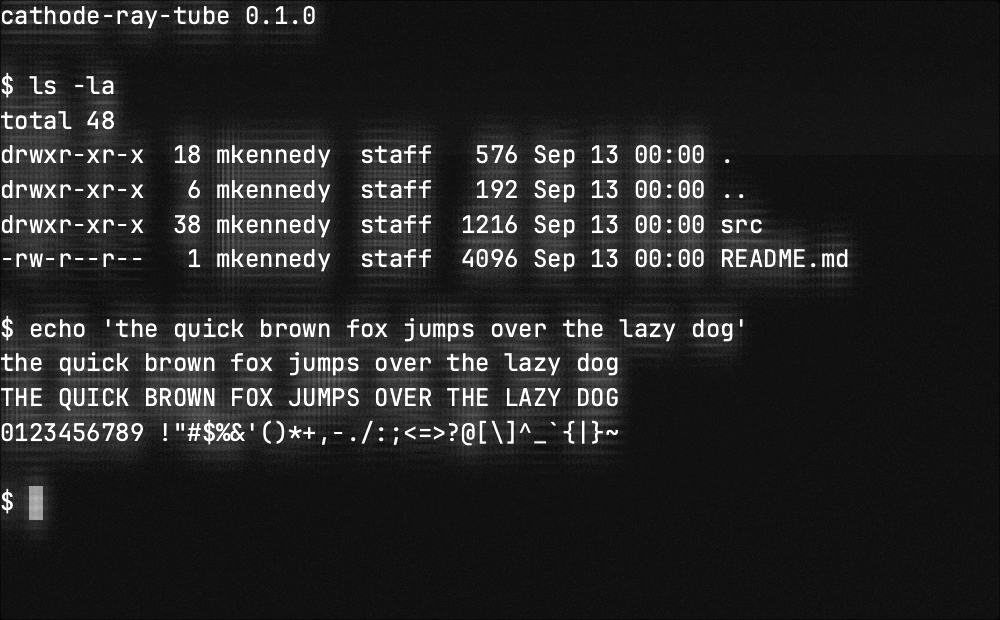 Boring | 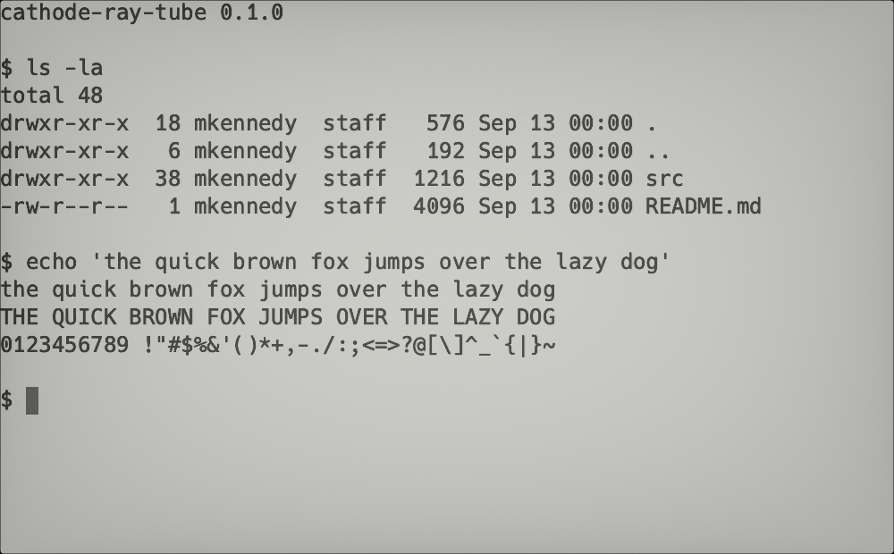 E-Ink | |

`make test` is 340 checks; `make app` builds a bundle and `make release` a
signed, notarised disk image. Still to come: the font manager and a settings
window.

## Building

Needs a Mac with the Command Line Tools (for `cc`), SBCL, and
[ocicl](https://github.com/ocicl/ocicl).

```sh
make deps     # build vendor/lib/libcathode.dylib, restore the Lisp dependencies
make run      # open a terminal
make test     # 181 checks
make probe    # prove this machine can do what the design assumes
```

`make probe` is not a test but a report. It answers, by measuring:

- Does a Metal **render** pipeline work from Lisp? (`objc` ships tested *compute*
  examples and nothing else, so this was the project's biggest unknown.)
- Do `[[function_constant(n)]]` specialisations genuinely fold? That mechanism
  replaces cool-retro-term's 56 precompiled `.qsb` shader variants with one
  `.metal` source, so it had to be proven rather than assumed.
- Do the by-value structure crossings work — `MTLClearColor` (a 32-byte
  homogeneous float aggregate), `MTLViewport` and `MTLRegion` (48 bytes,
  indirect), and an `NSError**` out-param?
- Does libvterm drive correctly through the shim, including a `VTermRect`
  arriving in a Lisp callback **by value**?
- Does `TIOCSWINSZ` actually reach the child?

On an M3 it prints 29 checks and 0 failures. Re-run it after an OS or Xcode
update: every answer in it is about the platform, not about this code.

## Why there is C in here

`vendor/shim/crt_shim.c` is about 200 lines and exists for one reason: CFFI,
without libffi, cannot pass or return a structure by value. `foreign-funcall`
cannot call such a function and `defcallback` signals `CASE-FAILURE` when asked
to receive one. libvterm crosses that line in four calls and three callbacks,
and Apple's arm64 variadic ABI breaks an eighth case:

```
plain foreign-funcall of ioctl(TIOCSWINSZ)   returns -1, child's `stty size': "0 0"
crt_set_winsize                              returns  0, child's `stty size': "30 100"
```

The alternative is `cffi-libffi`, which needs `cffi-grovel` and therefore a C
toolchain at *Lisp* build time, and risks linking Homebrew's libffi into a
bundle that has to run on a Mac which has never had Homebrew. Flattening the
crossings in the C we are already compiling is cheaper and has no runtime cost.

`vendor/` builds to a single `libcathode.dylib` that links nothing outside
`/usr/lib` and `/System` — `make -C vendor check` enforces that.

## Licence

**GPL-3.** The shader math and the profile data are ported from cool-retro-term,
which is GPL-3, so this is too. See [CREDITS.md](CREDITS.md) — the fonts and
libvterm keep their own licences.
